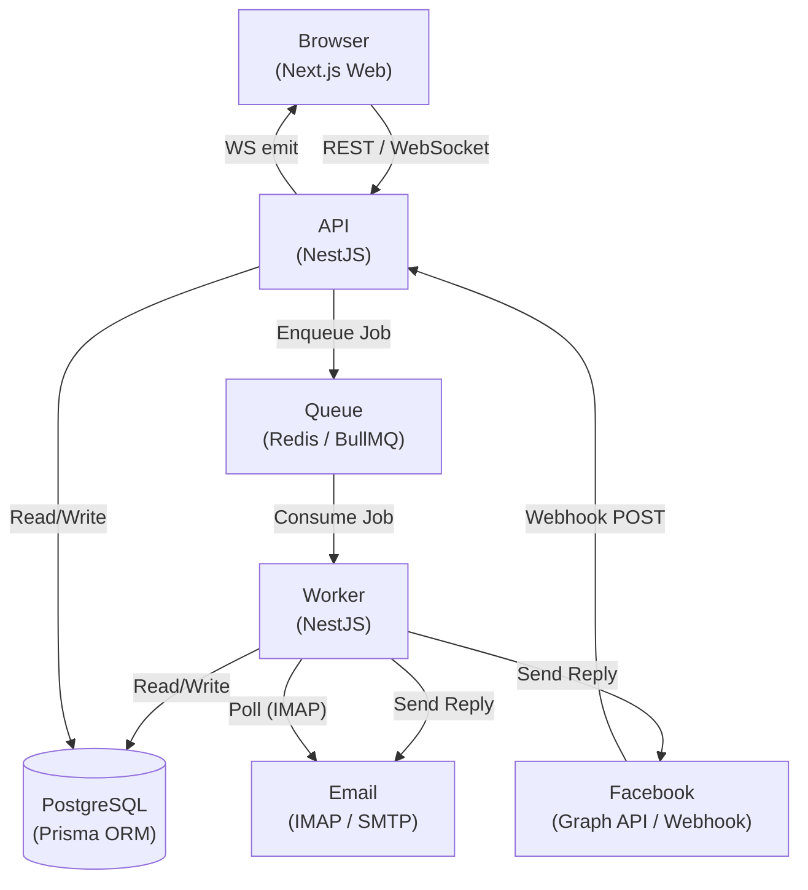
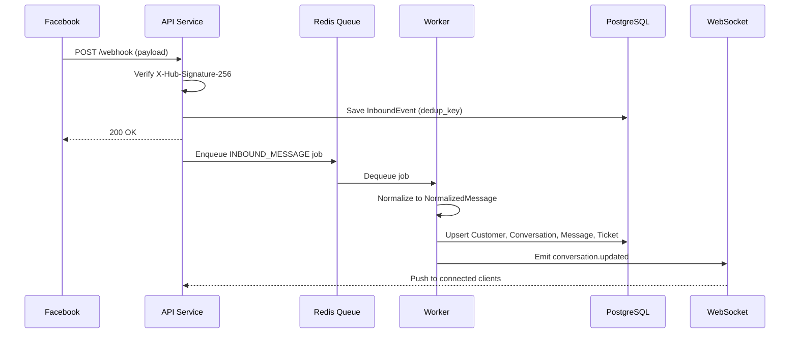
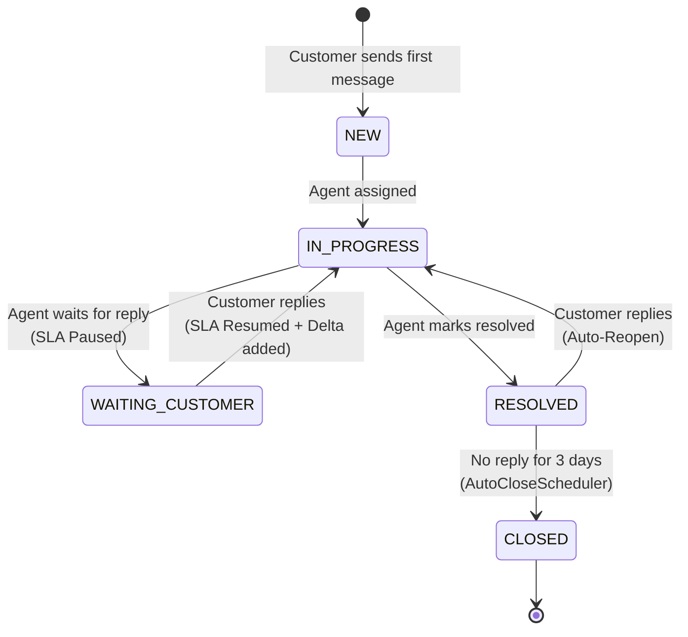

# 🌐 OmniDesk

<div align="center">
  <p><strong>An Omnichannel Customer Support Platform for Facebook and Email</strong></p>
  <p>
    
    
    
    
    
    
    
  </p>
</div>

---

## 📖 About The Project

OmniDesk is a modern helpdesk platform that solves the problem of fragmented customer communications. Businesses managing multiple support channels - Facebook Messenger, Facebook Comments, and Email-often lose track of requests across different tabs and tools.

OmniDesk standardizes every customer interaction into a unified `Conversation → Message → Ticket` hierarchy, giving support agents a single place to read, respond, and manage all requests. It features real-time updates via WebSockets, automated ticket lifecycle workflows, and a queue-based background processing architecture designed for reliability at scale.

---

## ✨ Key Features

| Feature | Description |
|---|---|
| 🗂 **Unified Inbox** | Manage Facebook Messenger, Facebook Comments, and Email from a single dashboard. |
| 📊 **SLA Tracking** | Automatic countdown based on ticket priority (Urgent: 2h, High: 8h, Medium: 24h, Low: 72h). |
| ⏸ **SLA Pause** | Automatically freezes the SLA timer when awaiting a customer reply (`WAITING_CUSTOMER` status). |
| 🔄 **Auto-Reopen** | Reopens resolved tickets and restores full SLA if a customer replies. |
| 🔒 **Auto-Close** | Permanently closes tickets that have been in `RESOLVED` state for more than 3 days. |
| 🛡 **Idempotency** | Dedup keys on all inbound events prevent duplicate processing when webhooks are retried. |
| 📤 **Outbox Pattern** | Outbound messages are persisted before sending, enabling automatic retry on provider failure. |
| ⚡ **Real-time Sync** | WebSocket events keep the Inbox UI updated instantly across all connected agents. |
| 🚦 **Concurrency Control** | Row-Level Locking in PostgreSQL serializes concurrent webhooks to prevent duplicate data generation. |
| 🧪 **Mock Mode** | A fully mocked environment for demos without requiring live Facebook API credentials. |
| 🔒 **Security** | Robust Auth with HttpOnly Cookies, Refresh Token Rotation, RBAC (`ADMIN`/`AGENT`), and password reset/invitation flows. |

---

## 🏛 Architecture

OmniDesk is built as a **Modular Monolith** with a dedicated background Worker process, communicating through a Redis queue. Module boundaries are intentionally defined to be **Microservice-Ready** — each module can be extracted into an independent service in a future phase.

### System Overview



### Inbound Message Flow



### Automated Ticket Lifecycle



---

## 🛠 Tech Stack

| Layer | Technology |
|---|---|
| **Frontend** | Next.js 16, React 19, TailwindCSS 4, TypeScript |
| **Backend** | NestJS 11, TypeScript, Socket.io, Passport + JWT |
| **ORM & Database** | Prisma ORM, PostgreSQL 16 |
| **Queue & Scheduling** | BullMQ, Redis 7, IORedis |
| **Email** | IMAPFlow (Inbound), Nodemailer (Outbound) |
| **Package Manager** | PNPM Workspaces (Monorepo) |
| **Infrastructure** | Docker, Docker Compose |

---

## 📂 Project Structure

```text
omnidesk/
├── apps/
│   ├── api/          # NestJS Main REST API & Webhook handler (port 3000)
│   ├── web/          # Next.js Frontend — Unified Inbox & Dashboard (port 3002)
│   └── worker/       # NestJS Background Worker — Queues, Crons, Email sync
├── packages/
│   └── shared/       # Shared TypeScript types and utilities
├── docs/             # API spec, event contracts, architecture notes
├── .env.docker.example
├── docker-compose.yml
└── Dockerfile
```

---

## 🚀 Getting Started

### Prerequisites

- **Docker** (for the Docker setup) → [Install Docker](https://www.docker.com/)
- **Node.js v18+** and **PNPM v8+** (for local development only)

---

### Option 1: Run with Docker *(Recommended)*

Start the entire stack — PostgreSQL, Redis, API, Worker, and Web — with a single command.

**1. Prepare environment variables:**
```bash
cp .env.docker.example .env.docker
```

**2. Start the system:**
```bash
docker compose up --build -d
```
> Docker will install dependencies, build all apps, and automatically run database migrations on first start.

**3. Access the application:**
- Web UI: **http://localhost:3002**
- API: http://localhost:3000

---

### Option 2: Local Development

Use this option if you want to debug or actively modify source code with hot-reload.

**1. Start infrastructure only:**
```bash
docker compose up -d postgres redis
```

**2. Install dependencies and initialize the database:**
```bash
pnpm install
pnpm --filter api exec prisma migrate dev
pnpm --filter api exec prisma generate
```

**3. Start all services (open 3 separate terminals):**
```bash
pnpm dev:api     # Terminal 1 — API on port 3000
pnpm dev:worker  # Terminal 2 — Background Worker
pnpm dev:web     # Terminal 3 — Web UI on port 3002
```

---

## 🎮 Usage & Demo

Once running, visit: **http://localhost:3002**

### Default Login Credentials

| Role | Email | Password |
|---|---|---|
| Admin | `admin@omnidesk.local` | `password` |
| Agent | `agent@omnidesk.local` | `password` |

Admin users can open the user management screen to create new `ADMIN`/`AGENT` accounts and activate or deactivate users. New users receive a setup-password link through SMTP when configured, or through API logs in mock email mode.

The login page also supports forgot password. Reset links expire after 1 hour and invalidate the user's refresh token after a successful password change.

### Seed Demo Data

To instantly populate the inbox with mock conversations (no live Facebook connection required):

```bash
curl -X POST http://localhost:3000/api/v1/dev/seed-demo-data
```

New tickets will appear in the Unified Inbox in real-time via WebSocket.

To reset demo data:
```bash
curl -X POST http://localhost:3000/api/v1/dev/reset-demo-data
```

---

## ⚙️ Environment Variables

Copy `.env.docker.example` to `.env.docker` (for Docker) or `.env` (for local dev) and fill in the values.

| Variable | Description | Required |
|---|---|---|
| `DATABASE_URL` | Full PostgreSQL connection string. | ✅ |
| `REDIS_HOST` | Hostname of the Redis server. | ✅ |
| `REDIS_PORT` | Port of the Redis server. | ✅ |
| `JWT_SECRET` | Secret key used to sign auth tokens. Change this in production. | ✅ |
| `API_PORT` | Port the API server listens on. Defaults to `3000`. | ✅ |
| `NEXT_PUBLIC_API_BASE_URL` | Base URL of the API, accessible from the browser. | ✅ |
| `FACEBOOK_APP_SECRET` | Used to verify incoming webhook signatures from Meta. | Production |
| `PAGE_ACCESS_TOKEN` | Used to send outbound messages via Meta Graph API. | Production |

---

## 📄 License & Acknowledgments

This project was developed as an academic graduation project and portfolio showcase.

- Integration guidelines reference [Meta for Developers — Webhooks](https://developers.facebook.com/docs/messenger-platform/webhooks).
- Background job architecture inspired by [BullMQ Documentation](https://docs.bullmq.io).
- Outbox pattern concept from [microservices.io](https://microservices.io/patterns/data/transactional-outbox.html).
