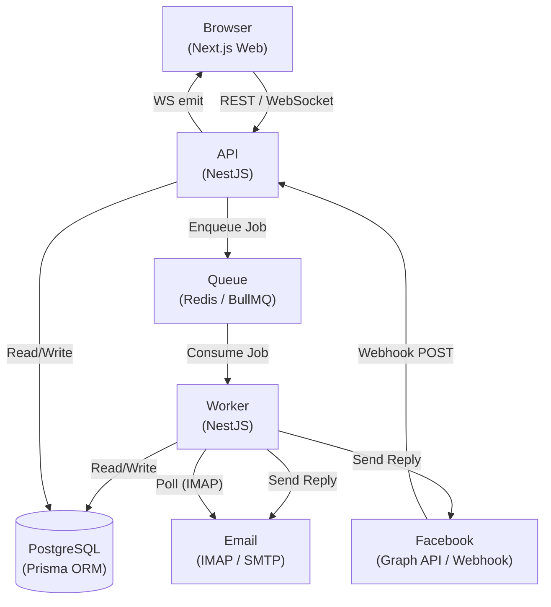
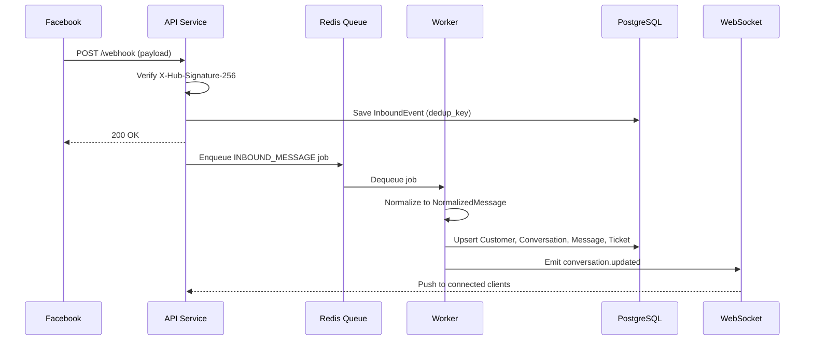
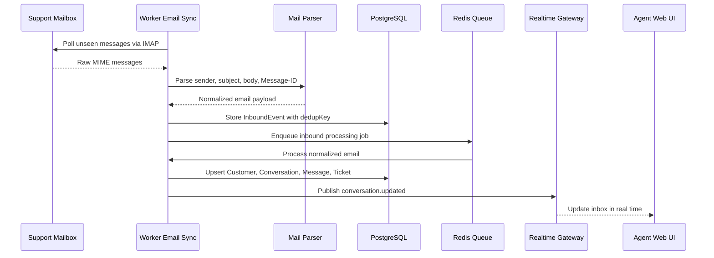
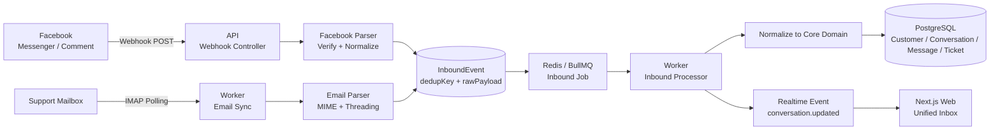
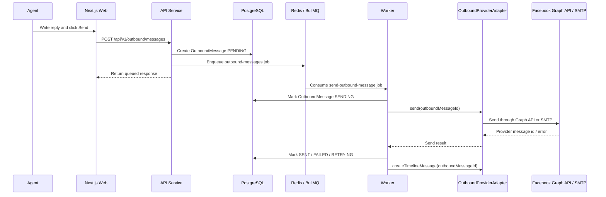
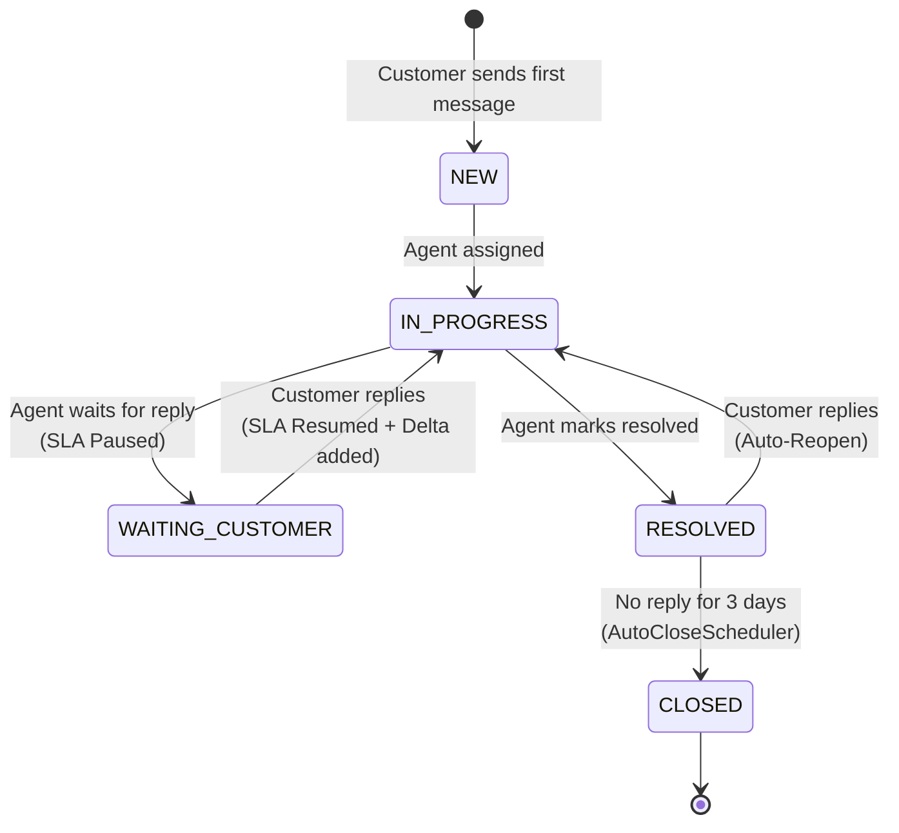
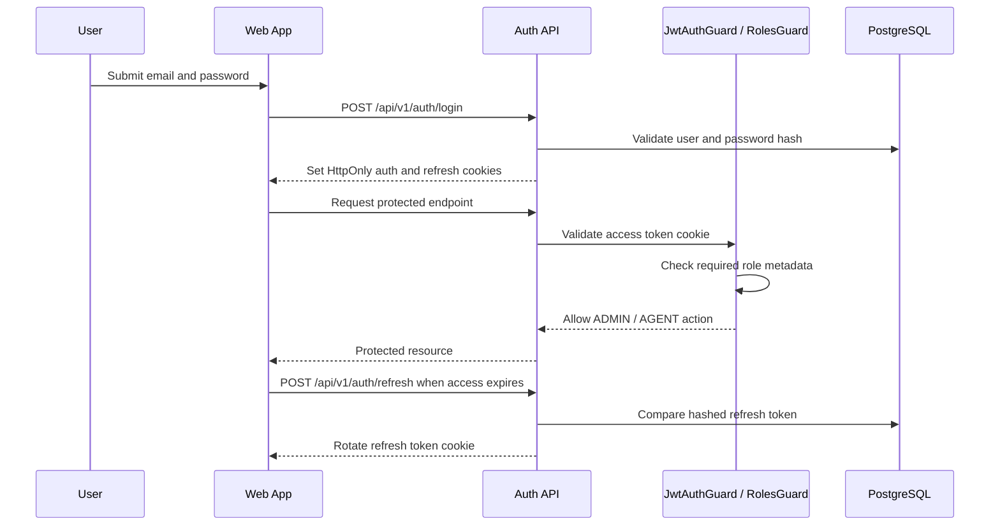
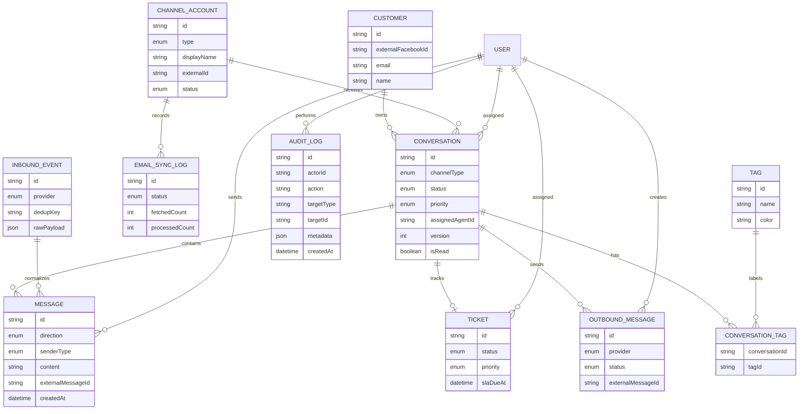

# 🌐 OmniDesk

<div align="center">
  <p><strong>An Omnichannel Customer Support Platform for Facebook and Email</strong></p>
  <p>
    
    
    
    
    
    
    
  </p>
</div>

---

## 📖 About The Project

OmniDesk is a modern helpdesk platform that solves the problem of fragmented customer communications. Businesses managing multiple support channels - Facebook Messenger, Facebook Comments, and Email-often lose track of requests across different tabs and tools.

OmniDesk standardizes every customer interaction into a unified `Conversation → Message → Ticket` hierarchy, giving support agents a single place to read, respond, and manage all requests. The primary integration path is live Facebook Webhooks/Graph API and live IMAP/SMTP email; mock providers remain available as a local/demo fallback. It features real-time updates via WebSockets, automated ticket lifecycle workflows, and a queue-based background processing architecture designed for reliability at scale.

---

## ✨ Key Features

| Feature | Description |
|---|---|
| **Unified Inbox** | Manage Facebook Messenger, Facebook Comments, and Email from a single dashboard. |
| **SLA Tracking** | Automatic countdown based on ticket priority (Urgent: 2h, High: 8h, Medium: 24h, Low: 72h). |
| **SLA Pause** | Automatically freezes the SLA timer when awaiting a customer reply (`WAITING_CUSTOMER` status). |
| **Auto-Reopen** | Reopens resolved tickets and restores full SLA if a customer replies. |
| **Auto-Close** | Permanently closes tickets that have been in `RESOLVED` state for more than 3 days. |
| **Idempotency** | Dedup keys on all inbound events prevent duplicate processing when webhooks are retried. |
| **Outbox + Provider Adapters** | Outbound messages are persisted before sending; worker adapters isolate SMTP and Facebook Graph API delivery logic. |
| **Real-time Sync** | WebSocket events keep the Inbox UI updated instantly across all connected agents. |
| **Concurrency Control** |Inbound dedup keys, customer row-level locking, and optimistic version checks reduce duplicate processing and stale agent updates. |
| **Live Provider Integration** | Connects to Facebook Webhooks/Graph API and IMAP/SMTP email for real inbound/outbound flows. |
| **Fallback Mock Mode** | Mock adapters and dev endpoints remain available for local development and demo fallback when external providers are unavailable. |
| **Security** | Robust Auth with HttpOnly Cookies, Refresh Token Rotation, RBAC (`ADMIN`/`AGENT`), and password reset/invitation flows. |

---

## 🏛 Architecture

OmniDesk is built as a **Modular Monolith** with a dedicated background Worker process, communicating through a Redis queue. Module boundaries are intentionally defined to be **Microservice-Ready** — each module can be extracted into an independent service in a future phase.

### System Overview

This diagram shows the runtime shape of OmniDesk: Web handles the agent UI, API handles REST/auth/webhooks/realtime gateway, Worker handles slow jobs, Redis carries queue traffic, and PostgreSQL stores the core domain state.



### Facebook Inbound Webhook Flow

This sequence focuses on the Facebook-specific inbound path. Meta calls the API webhook, the API verifies the request and persists the raw event quickly, then Worker normalizes it into the shared conversation model.



### Email Polling Flow

This sequence highlights why email is separate from Facebook inbound. Instead of receiving a generic webhook, Worker polls the mailbox over IMAP, parses MIME content, and then enters the same internal processing pipeline.



### Unified Inbound Processing Flow

This diagram merges both inbound channels after their provider-specific entry points. Facebook and Email differ at the edge, but both become `InboundEvent` records and then flow through the same queue, worker, domain model, and realtime UI update.



### Outbound Reply + Adapter Flow

This sequence shows the Outbox + Adapter pattern. API only persists and queues the reply; Worker chooses the correct adapter so Facebook Graph API and SMTP stay outside the core outbound processor.



### Automated Ticket Lifecycle

This state diagram describes the business lifecycle of a support request after messages have been normalized into a conversation and ticket.



### Auth, Refresh Token, and RBAC Flow

This sequence explains authentication and authorization. Access/refresh tokens are stored in HttpOnly cookies, refresh tokens rotate through the database, and protected endpoints are checked by JWT and role guards.



### Core Data Model

This ER diagram is a compact map of the main persistence model used by the inbox, ticket workflow, inbound deduplication, outbound outbox, and user assignment features.



---

## 🛠 Tech Stack

| Layer | Technology |
|---|---|
| **Frontend** | Next.js 16, React 19, TailwindCSS 4, TypeScript |
| **Backend** | NestJS 11, TypeScript, Socket.io, Passport + JWT |
| **ORM & Database** | Prisma ORM, PostgreSQL 16 |
| **Queue & Scheduling** | BullMQ, Redis 7, IORedis |
| **Email** | IMAPFlow (Inbound), Nodemailer (Outbound) |
| **Package Manager** | PNPM Workspaces (Monorepo) |
| **Infrastructure** | Docker, Docker Compose |

---

## 🔎 Observability Foundation

OmniDesk includes a lightweight observability baseline for local and production-like deployments:

| Area | Current Implementation |
|---|---|
| **Request tracing** | API assigns or preserves `x-request-id`, returns it in the response header, and logs method, path, status, duration, IP, and user agent. |
| **Queue visibility** | API and Worker log enqueue/completion/failure events with `queue`, `jobName`, `jobId`, attempts, and key business ids such as `inboundEventId`, `outboundMessageId`, `conversationId`, and `messageId`. |
| **Provider debugging** | `InboundEvent` stores raw provider payloads, `dedupKey`, processing status, and error messages. `OutboundMessage` stores provider, status, retry count, external id, and last error. |
| **Health checks** | API, Worker, Web, PostgreSQL, and Redis are covered by Docker Compose health checks. |
| **Operational dashboard** | Dashboard APIs expose ticket summary, SLA overdue counts, channel distribution, and agent performance for business-level monitoring. |

Full metrics/tracing with OpenTelemetry, Prometheus, Grafana, and centralized log aggregation is intentionally kept as a production hardening step.

---

## 📂 Project Structure

```text
omnidesk/
├── apps/
│   ├── api/          # NestJS Main REST API & Webhook handler (port 3000)
│   ├── web/          # Next.js Frontend — Unified Inbox & Dashboard (port 3002)
│   └── worker/       # NestJS Background Worker — Queues, Crons, Email sync
├── packages/
│   └── shared/       # Shared TypeScript types and utilities
├── docs/             # API spec, event contracts, architecture notes
├── .env.docker.example
├── docker-compose.yml
└── Dockerfile
```

---

## 🚀 Getting Started

### Prerequisites

- **Docker** (for the Docker setup) → [Install Docker](https://www.docker.com/)
- **Node.js v18+** and **PNPM v8+** (for local development only)

---

### Option 1: Run with Docker *(Recommended)*

Start the entire stack — PostgreSQL, Redis, API, Worker, and Web — with a single command.

**1. Prepare environment variables:**
```bash
cp .env.docker.example .env.docker
```

**2. Start the system:**
```bash
pnpm docker:up
```
> Docker builds all apps, waits for PostgreSQL/Redis health checks, and runs database migrations when the API starts.

**Optional database commands:**
```bash
pnpm docker:migrate  # run Prisma migrate deploy explicitly
pnpm docker:seed     # seed initial demo/admin data
```

**3. Access the application:**
- Web UI: **http://localhost:3002**
- API: http://localhost:3000

---

### Option 2: Local Development

Use this option if you want to debug or actively modify source code with hot-reload.

**1. Start infrastructure only:**
```bash
docker compose up -d postgres redis
```

**2. Install dependencies and initialize the database:**
```bash
pnpm install
pnpm --filter api exec prisma migrate dev
pnpm --filter api exec prisma generate
```

**3. Start all services (open 3 separate terminals):**
```bash
pnpm dev:api     # Terminal 1 — API on port 3000
pnpm dev:worker  # Terminal 2 — Background Worker
pnpm dev:web     # Terminal 3 — Web UI on port 3002
```

---

## 🎮 Usage & Demo

Once running, visit: **http://localhost:3002**

### Default Login Credentials

| Role | Email | Password |
|---|---|---|
| Admin | `admin@omnidesk.local` | `password` |
| Agent | `agent@omnidesk.local` | `password` |

Admin users can open the user management screen to create new `ADMIN`/`AGENT` accounts and activate or deactivate users. New users receive a setup-password link through SMTP when configured, or through API logs in mock email mode.

The login page also supports forgot password. Reset links expire after 1 hour and invalidate the user's refresh token after a successful password change.

### Live Provider Smoke Test

For a live-ready run, configure the Facebook Page access token, webhook verify token, app secret, and IMAP/SMTP credentials. Then send a real Messenger message/comment to the connected Page and a real email to the support mailbox; both should appear in the Unified Inbox, and agent replies should be delivered back through the original provider.

### Fallback Demo Data

To instantly populate the inbox with mock conversations when external providers are unavailable:

```bash
curl -X POST http://localhost:3000/api/v1/dev/seed-demo-data
```

New tickets will appear in the Unified Inbox in real-time via WebSocket.

To reset demo data:
```bash
curl -X POST http://localhost:3000/api/v1/dev/reset-demo-data
```

> `/dev/*` endpoints are available only when `NODE_ENV` is not `production`. In production, use live Facebook Webhooks/Graph API and IMAP/SMTP provider configuration.

---

## ⚙️ Environment Variables

Copy `.env.docker.example` to `.env.docker` (for Docker) or `.env` (for local dev) and fill in the values.

Local Docker defaults to `NODE_ENV=development` and mock provider modes so the stack can run without external credentials. For production, set `NODE_ENV=production`, replace both JWT secrets with long random values, set Email/Facebook provider modes to `live`, and provide all IMAP/SMTP/Facebook credentials. The API and Worker fail fast if production is started with mock modes, missing provider credentials, or insecure `change-me` secrets.

| Variable | Description | Required |
|---|---|---|
| `DATABASE_URL` | Full PostgreSQL connection string. | ✅ |
| `REDIS_HOST` | Hostname of the Redis server. | ✅ |
| `REDIS_PORT` | Port of the Redis server. | ✅ |
| `JWT_SECRET` | Secret key used to sign auth tokens. Change this in production. | ✅ |
| `JWT_REFRESH_SECRET` | Secret key used to sign refresh tokens. Change this in production. | ✅ |
| `API_PORT` | Port the API server listens on. Defaults to `3000`. | ✅ |
| `NEXT_PUBLIC_API_BASE_URL` | Base URL of the API, accessible from the browser. | ✅ |
| `FACEBOOK_PROVIDER_MODE` | `live` for Meta integration, `mock` for local fallback. | Production |
| `FACEBOOK_APP_ID` | Meta application id for the connected Facebook app. | Production |
| `FACEBOOK_APP_SECRET` | Used to verify incoming webhook signatures from Meta. | Production |
| `FACEBOOK_VERIFY_TOKEN` | Token configured in Meta Webhooks for callback verification. | Production |
| `FACEBOOK_PAGE_ACCESS_TOKEN` | Used to send outbound messages via Meta Graph API. | Production |
| `EMAIL_INBOUND_MODE` | `live` to poll IMAP, `mock` for dev fallback. | Production |
| `EMAIL_OUTBOUND_MODE` | `live` to send SMTP, `mock` to log outbound links/messages. | Production |
| `EMAIL_IMAP_*` | IMAP host, port, auth and mailbox settings for inbound email. | Production |
| `EMAIL_SMTP_*` | SMTP host, port and auth settings for outbound email and auth emails. | Production |
| `NGROK_DOMAIN` | Optional custom ngrok domain used by `pnpm dev:ngrok`. | Local |

---

## 📄 License & Acknowledgments

This project was developed as an academic graduation project and portfolio showcase.

- Integration guidelines reference [Meta for Developers - Webhooks](https://developers.facebook.com/docs/messenger-platform/webhooks), [Meta for Developers - Graph API](https://developers.facebook.com/docs/graph-api), and [Meta for Developers - Messenger Platform](https://developers.facebook.com/docs/messenger-platform).
- Background job architecture inspired by [BullMQ Documentation](https://docs.bullmq.io), [Redis Documentation](https://redis.io/docs/), and [NestJS Bull Module](https://docs.nestjs.com/techniques/queues).
- Outbox pattern concept from [microservices.io](https://microservices.io/patterns/data/transactional-outbox.html).
- IMAP and SMTP handling references [IMAPFlow](https://imapflow.com/) and [Nodemailer](https://nodemailer.com/about/).
