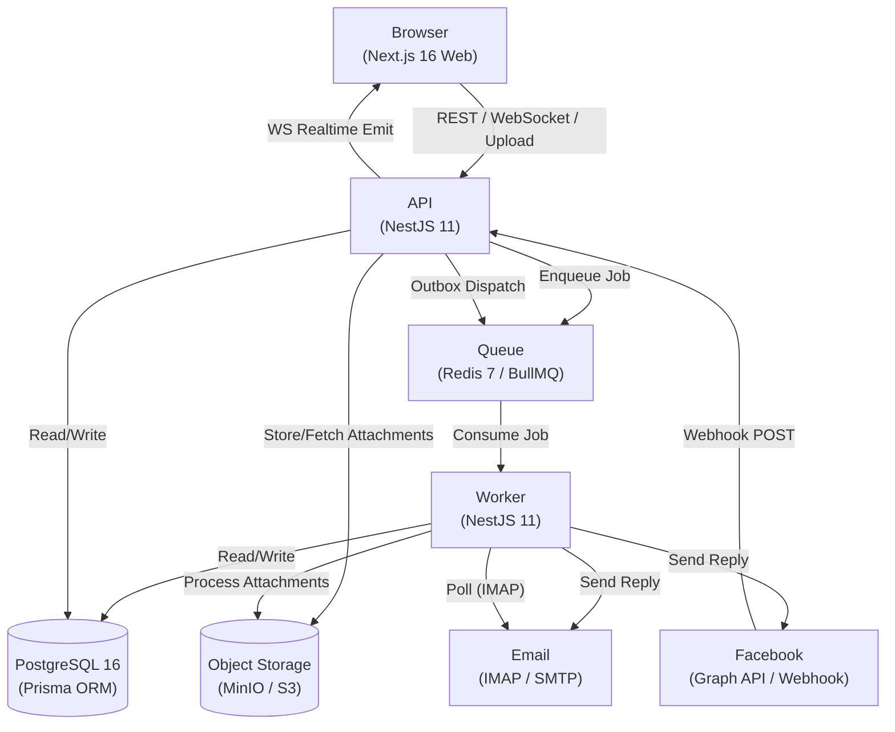
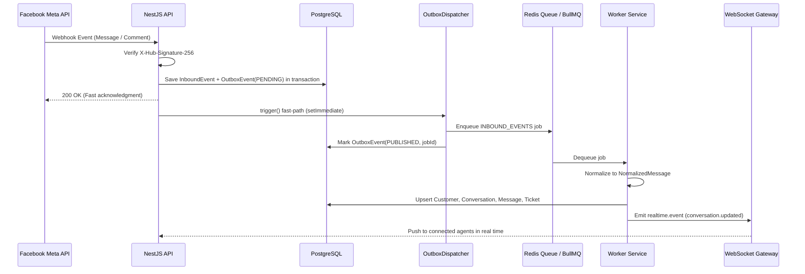
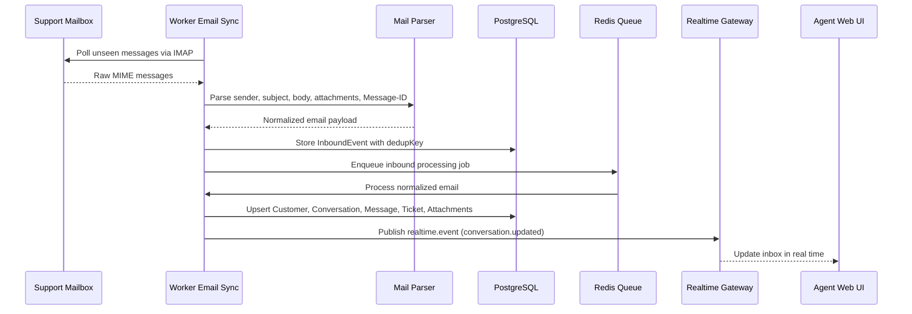
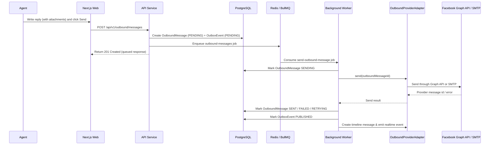
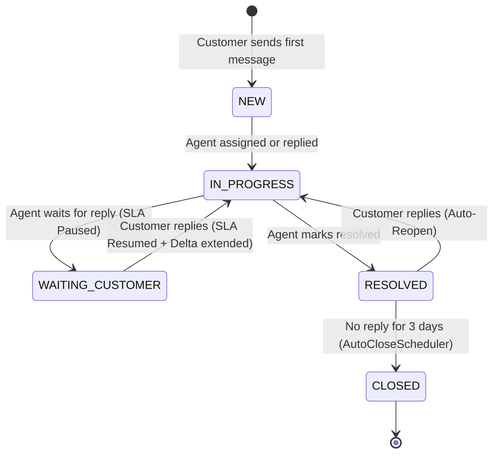

# 🌐 OmniDesk

<div align="center">
  <p><strong>An Omnichannel Customer Support Platform for Facebook and Email</strong></p>
  <p>
    
    
    
    
    
    
    
    
    
  </p>
</div>

---

## 📖 About The Project

OmniDesk is a modern helpdesk platform that solves the problem of fragmented customer communications. Businesses managing multiple support channels — Facebook Messenger, Facebook Comments, and Email — often lose track of requests across different tabs and tools.

OmniDesk standardizes every customer interaction into a unified `Conversation -> Message -> Ticket` hierarchy, giving support agents a single place to read, respond, and manage all requests. The primary integration path is live Facebook Webhooks/Graph API and live IMAP/SMTP email; mock providers remain available as a local/demo fallback. It features real-time updates via WebSockets, file attachment storage via S3/MinIO, transactional outbox delivery with dead-letter replay, automated ticket lifecycle workflows, and a queue-based background processing architecture designed for reliability at scale.

---

## ✨ Key Features

| Feature | Description |
|---|---|
| **Unified Inbox** | Manage Facebook Messenger, Facebook Comments, and Email from a single dashboard. |
| **SLA Tracking & Pause** | Automatic SLA timer by priority (Urgent: 2h, High: 8h, Medium: 24h, Low: 72h). Automatically freezes when awaiting customer reply (`WAITING_CUSTOMER`). |
| **Auto-Reopen & Auto-Close** | Automatically reopens resolved tickets upon new customer replies, and auto-closes tickets in `RESOLVED` state after 3 days. |
| **File & Image Attachments** | S3/MinIO integration supporting drag-and-drop image uploads, document attachments, file preview strips, and on-demand streaming. |
| **Transactional Outbox** | Guarantees at-least-once delivery with `OutboxDispatcherService`, dead-letter queue (`DEAD` status), and resilient event replay protocols. |
| **Real-time Collaboration** | WebSockets powered by Socket.io for instant message delivery, live conversation updates, and real-time agent typing indicators (`agent_typing`). |
| **High-Performance Pagination** | Cursor-based message pagination with zero-latency optimistic delivery and reverse infinite scroll. |
| **Concurrency & Idempotency** | Inbound dedup keys, customer row-level locking, and Optimistic Concurrency Control (`version` checks on conversations) eliminate race conditions. |
| **Centralized Mail Service** | Unified `MailService` with DI injection for auth verification, password reset links, invitations, and customer communications. |
| **Live & Mock Providers** | Full production integration for Facebook Graph API/Webhooks and IMAP/SMTP email with zero-dependency mock mode for local testing. |
| **Enterprise Security** | HttpOnly cookie-based JWT authentication, Refresh Token Rotation, RBAC (`ADMIN`/`AGENT`), rate limiting, and HTML XSS sanitization. |

---

## 🏛 Architecture

OmniDesk is built as a **Modular Monolith** with a dedicated background Worker process, communicating through a Redis queue. Module boundaries are intentionally defined to be **Microservice-Ready** — each module can be extracted into an independent service in a future phase.

### System Overview


```mermaid
graph TD
    Browser["Browser<br>(Next.js 16 Web)"]
    API["API<br>(NestJS 11)"]
    Worker["Worker<br>(NestJS 11)"]
    Queue["Queue<br>(Redis 7 / BullMQ)"]
    DB[("PostgreSQL 16<br>(Prisma ORM)")]
    Storage[("Object Storage<br>(MinIO / S3)")]
    FB["Facebook<br>(Graph API / Webhook)"]
    Email["Email<br>(IMAP / SMTP)"]

    Browser -- "REST / WebSocket / Upload" --> API
    FB -- "Webhook POST" --> API
    API -- "Enqueue Job" --> Queue
    API -- "Outbox Dispatch" --> Queue
    Queue -- "Consume Job" --> Worker
    Worker -- "Read/Write" --> DB
    API -- "Read/Write" --> DB
    API -- "Store/Fetch Attachments" --> Storage
    Worker -- "Process Attachments" --> Storage
    Worker -- "Send Reply" --> FB
    Worker -- "Send Reply" --> Email
    Worker -- "Poll (IMAP)" --> Email
    API -- "WS Realtime Emit" --> Browser
```

### Facebook Inbound Webhook Flow


```mermaid
sequenceDiagram
    participant FB as Facebook Meta API
    participant API as NestJS API
    participant DB as PostgreSQL
    participant OD as OutboxDispatcher
    participant Q as Redis Queue / BullMQ
    participant W as Worker Service
    participant WS as WebSocket Gateway

    FB->>API: Webhook Event (Message / Comment)
    API->>API: Verify X-Hub-Signature-256
    API->>DB: Save InboundEvent + OutboxEvent(PENDING) in transaction
    API-->>FB: 200 OK (Fast acknowledgment)
    API->>OD: trigger() fast-path (setImmediate)
    OD->>Q: Enqueue INBOUND_EVENTS job
    OD->>DB: Mark OutboxEvent(PUBLISHED, jobId)
    Q->>W: Dequeue job
    W->>W: Normalize to NormalizedMessage
    W->>DB: Upsert Customer, Conversation, Message, Ticket
    W->>WS: Emit realtime.event (conversation.updated)
    WS-->>API: Push to connected agents in real time
```

### Email Polling Flow


```mermaid
sequenceDiagram
    participant Mailbox as Support Mailbox
    participant Worker as Worker Email Sync
    participant Parser as Mail Parser
    participant DB as PostgreSQL
    participant Q as Redis Queue
    participant WS as Realtime Gateway
    participant Web as Agent Web UI

    Worker->>Mailbox: Poll unseen messages via IMAP
    Mailbox-->>Worker: Raw MIME messages
    Worker->>Parser: Parse sender, subject, body, attachments, Message-ID
    Parser-->>Worker: Normalized email payload
    Worker->>DB: Store InboundEvent with dedupKey
    Worker->>Q: Enqueue inbound processing job
    Q->>Worker: Process normalized email
    Worker->>DB: Upsert Customer, Conversation, Message, Ticket, Attachments
    Worker->>WS: Publish realtime.event (conversation.updated)
    WS-->>Web: Update inbox in real time
```

### Outbound Reply & Outbox Adapter Flow


```mermaid
sequenceDiagram
    participant Agent
    participant Web as Next.js Web
    participant API as API Service
    participant DB as PostgreSQL
    participant Q as Redis / BullMQ
    participant Worker as Background Worker
    participant Adapter as OutboundProviderAdapter
    participant Provider as Facebook Graph API / SMTP

    Agent->>Web: Write reply (with attachments) and click Send
    Web->>API: POST /api/v1/outbound/messages
    API->>DB: Create OutboundMessage (PENDING) + OutboxEvent (PENDING)
    API->>Q: Enqueue outbound-messages job
    API-->>Web: Return 201 Created (queued response)
    Q->>Worker: Consume send-outbound-message job
    Worker->>DB: Mark OutboundMessage SENDING
    Worker->>Adapter: send(outboundMessageId)
    Adapter->>Provider: Send through Graph API or SMTP
    Provider-->>Adapter: Provider message id / error
    Adapter-->>Worker: Send result
    Worker->>DB: Mark OutboundMessage SENT / FAILED / RETRYING
    Worker->>DB: Mark OutboxEvent PUBLISHED
    Worker->>Adapter: Create timeline message & emit realtime event
```

### Automated Ticket Lifecycle


```mermaid
stateDiagram-v2
    [*] --> NEW : Customer sends first message
    NEW --> IN_PROGRESS : Agent assigned or replied
    IN_PROGRESS --> WAITING_CUSTOMER : Agent waits for reply (SLA Paused)
    WAITING_CUSTOMER --> IN_PROGRESS : Customer replies (SLA Resumed + Delta extended)
    IN_PROGRESS --> RESOLVED : Agent marks resolved
    RESOLVED --> IN_PROGRESS : Customer replies (Auto-Reopen)
    RESOLVED --> CLOSED : No reply for 3 days (AutoCloseScheduler)
    CLOSED --> [*]
```

### Core Data Model

```mermaid
erDiagram
    CUSTOMER ||--o{ CONVERSATION : owns
    CHANNEL_ACCOUNT ||--o{ CONVERSATION : receives
    CHANNEL_ACCOUNT ||--o{ EMAIL_SYNC_LOG : records
    CONVERSATION ||--o{ MESSAGE : contains
    CONVERSATION ||--o| TICKET : tracks_sla
    CONVERSATION ||--o{ OUTBOUND_MESSAGE : sends
    INBOUND_EVENT ||--o{ MESSAGE : normalizes
    MESSAGE ||--o{ ATTACHMENT : attaches
    USER ||--o{ CONVERSATION : assigned
    USER ||--o{ MESSAGE : sends
    USER ||--o{ OUTBOUND_MESSAGE : creates
    USER ||--o{ AUDIT_LOG : performs
    CONVERSATION ||--o{ CONVERSATION_TAG : has
    TAG ||--o{ CONVERSATION_TAG : labels
    OUTBOX_EVENT }|--|| CONVERSATION : relates

    CUSTOMER {
      string id PK
      string externalFacebookId UK
      string email UK
      string name
    }
    CHANNEL_ACCOUNT {
      string id PK
      enum type
      string displayName
      string externalId
      enum status
    }
    CONVERSATION {
      string id PK
      enum channelType
      enum status
      enum priority
      string assignedAgentId FK
      int version
      boolean isRead
    }
    MESSAGE {
      string id PK
      string conversationId FK
      enum direction
      enum senderType
      string content
      string externalMessageId
      string replyToMessageId
      datetime createdAt
    }
    ATTACHMENT {
      string id PK
      string messageId FK
      string storageKey
      string url
      string fileName
      string mimeType
      int sizeBytes
    }
    TICKET {
      string id PK
      string conversationId FK_UK
      datetime slaDueAt
      datetime slaPausedAt
      boolean isOverdue
      datetime firstResponseDueAt
    }
    OUTBOUND_MESSAGE {
      string id PK
      string conversationId FK
      enum provider
      enum status
      string externalMessageId
      string replyToMessageId
    }
    INBOUND_EVENT {
      string id PK
      enum provider
      string dedupKey UK
      json rawPayload
      enum normalizedStatus
      datetime processingStartedAt
    }
    OUTBOX_EVENT {
      string id PK
      string type
      string aggregateId
      json payload
      enum status
      int attempts
      string jobId
    }
    CONVERSATION_TAG {
      string conversationId PK_FK
      string tagId PK_FK
    }
    TAG {
      string id PK
      string name UK
      string color
    }
    EMAIL_SYNC_LOG {
      string id PK
      enum status
      int fetchedCount
      int processedCount
    }
    AUDIT_LOG {
      string id PK
      string actorId FK
      string action
      string targetType
      string targetId
      json metadata
      datetime createdAt
    }
```

---

## 🛠 Tech Stack

| Layer | Technology |
|---|---|
| **Frontend** | Next.js 16 (App Router / Standalone), React 19, TailwindCSS 4, Lucide Icons, TypeScript 5 |
| **Backend** | NestJS 11, TypeScript 5, Socket.io 4, Passport + JWT, Swagger / OpenAPI |
| **ORM & Database** | Prisma ORM 6, PostgreSQL 16 |
| **Queue & Scheduling** | BullMQ 5, Redis 7, IORedis |
| **Object Storage** | MinIO / S3 Object Storage (file uploads, image attachments) |
| **Email Service** | IMAPFlow (Inbound polling), Nodemailer & Centralized `MailService` (Outbound) |
| **Package Manager** | PNPM Workspaces 11 (Monorepo) |
| **Infrastructure** | Docker, Docker Compose, Multi-stage Dockerfile |

---

## 🔎 Observability & Reliability Foundation

OmniDesk includes a lightweight observability baseline for local and production deployments:

| Area | Current Implementation |
|---|---|
| **Request tracing** | API assigns `x-request-id`, returns it in response headers, and logs method, path, status, duration, IP, and user agent. |
| **Queue visibility** | API and Worker log enqueue/completion/failure events with `queue`, `jobName`, `jobId`, attempts, and entity IDs (`inboundEventId`, `outboundMessageId`, `conversationId`, `messageId`). |
| **Outbox resilience** | Transactional outbox pattern persists events in `outbox_events`, tracks attempts, manages dead events (`DEAD`), and supports automatic replays. |
| **Provider debugging** | `InboundEvent` stores raw provider payloads, `dedupKey`, processing status, and error logs. `OutboundMessage` stores provider, status, retry count, external ID, and last error. |
| **Health checks** | Health endpoints on API (`/api/v1/health`), Worker (`/health`), PostgreSQL, Redis, and MinIO are integrated with Docker health checks. |
| **Operational dashboard** | Dashboard APIs expose ticket summary, SLA overdue counts, channel distribution, and agent performance metrics. |

---

## 📂 Project Structure

```text
omnidesk/
├── apps/
│   ├── api/          # NestJS REST API, Webhooks, WebSockets & Attachments (port 3000)
│   ├── web/          # Next.js 16 Frontend — Unified Inbox & Dashboard (port 3002)
│   └── worker/       # NestJS Background Worker — Queues, S3 Storage, Crons, Email sync (port 3001)
├── packages/
│   └── shared/       # Shared TypeScript types, pagination helpers, validation schemas, and event contracts
├── docs/             # API spec, database design, event contracts, architecture notes
├── .env.docker.example
├── docker-compose.yml
├── docker-compose.staging.yml
└── Dockerfile
```

---

## 🚀 Getting Started

### Prerequisites

- **Docker & Docker Compose** (for Docker setup) -> [Install Docker](https://www.docker.com/)
- **Node.js v20+** and **PNPM v10+** (for local development only)

---

### Option 1: Run with Docker *(Recommended)*

Start the entire stack — PostgreSQL, Redis, MinIO, API, Worker, and Web — with a single command.

**1. Prepare environment variables:**
```bash
cp .env.docker.example .env.docker
```

**2. Start the system:**
```bash
pnpm docker:up
```
> Docker builds all apps, waits for PostgreSQL/Redis/MinIO health checks, and starts the full application cluster.

**Optional database migration & seed commands:**
```bash
pnpm docker:migrate  # run Prisma migrate deploy
pnpm docker:seed     # seed initial demo/admin data
```

**3. Access the application:**
- Web UI: **http://localhost:3002**
- API & Swagger Docs: **http://localhost:3000/api/docs**
- MinIO Storage Console: **http://localhost:9001** (User/Pass: `omnidesk` / `omnidesk123`)

---

### Option 2: Local Development

Use this option if you want to debug or actively modify source code with hot-reload.

**1. Start infrastructure only:**
```bash
docker compose up -d postgres redis minio
```

**2. Install dependencies and initialize the database:**
```bash
pnpm install
pnpm --filter api exec prisma migrate deploy
pnpm --filter api exec prisma generate
pnpm --filter api exec prisma db seed
```

**3. Start all services in parallel (or open 3 separate terminals):**
```bash
# Parallel mode:
pnpm dev

# Or separate terminals:
pnpm dev:api     # Terminal 1 — API on port 3000
pnpm dev:worker  # Terminal 2 — Background Worker on port 3001
pnpm dev:web     # Terminal 3 — Web UI on port 3002
```

---

## 🎮 Usage & Demo

Once running, visit: **http://localhost:3002**

### Default Login Credentials

| Role | Email | Password |
|---|---|---|
| Admin | `admin@omnidesk.local` | `password` |
| Agent | `agent@omnidesk.local` | `password` |

Admin users can open the user management screen to create new `ADMIN`/`AGENT` accounts and activate or deactivate users. New users receive an invitation setup-password link via SMTP or API logs in mock mode.

The login page also supports forgot password. Reset links expire after 1 hour and invalidate active refresh tokens upon successful reset.

### Fallback Demo Data

To instantly populate the inbox with mock conversations and sample tickets:

```bash
curl -X POST http://localhost:3000/api/v1/dev/seed-demo-data
```

New tickets will appear in the Unified Inbox in real time via WebSockets.

To reset demo data:
```bash
curl -X POST http://localhost:3000/api/v1/dev/reset-demo-data
```

> `/dev/*` endpoints are automatically disabled when `NODE_ENV=production`.

---

## ⚙️ Environment Variables

Copy `.env.docker.example` to `.env.docker` (for Docker) or `.env` (for local dev) and customize:

| Variable | Description | Required |
|---|---|---|
| `DATABASE_URL` | Full PostgreSQL connection string. | Yes |
| `REDIS_HOST` | Hostname of the Redis server. | Yes |
| `REDIS_PORT` | Port of the Redis server. | Yes |
| `JWT_SECRET` | Secret key used to sign auth tokens (32+ chars in production). | Yes |
| `JWT_REFRESH_SECRET` | Secret key used to sign refresh tokens (32+ chars in production). | Yes |
| `API_PORT` | Port the API server listens on (default `3000`). | Yes |
| `WEB_ORIGIN` | Allowed web origin for CORS and cookie authentication (`http://localhost:3002`). | Yes |
| `NEXT_PUBLIC_API_BASE_URL` | Base URL of the API, accessible from the browser (`http://localhost:3000/api/v1`). | Yes |
| `NEXT_PUBLIC_REALTIME_URL` | WebSocket namespace URL (`http://localhost:3000/notifications`). | Yes |
| `MINIO_ENDPOINT` | Object storage host or S3 endpoint. | Yes |
| `MINIO_PORT` | Object storage port (default `9000`). | Yes |
| `MINIO_ACCESS_KEY` | MinIO / S3 Access Key. | Yes |
| `MINIO_SECRET_KEY` | MinIO / S3 Secret Key. | Yes |
| `MINIO_BUCKET` | S3 bucket name for attachments (`omnidesk`). | Yes |
| `MINIO_PUBLIC_URL` | Public download URL base for file attachments. | Yes |
| `FACEBOOK_PROVIDER_MODE` | `live` for Meta integration, `mock` for local fallback. | Production |
| `FACEBOOK_APP_ID` | Meta application ID for the connected Facebook App. | Production |
| `FACEBOOK_APP_SECRET` | Used to verify incoming webhook signatures (`X-Hub-Signature-256`). | Production |
| `FACEBOOK_VERIFY_TOKEN` | Token configured in Meta Webhooks for verification. | Production |
| `FACEBOOK_PAGE_ACCESS_TOKEN` | Used to send outbound messages via Graph API. | Production |
| `EMAIL_INBOUND_MODE` | `live` to poll IMAP, `mock` for dev fallback. | Production |
| `EMAIL_OUTBOUND_MODE` | `live` to send SMTP, `mock` to log outbound links/messages. | Production |
| `EMAIL_IMAP_*` | IMAP host, port, auth and mailbox settings for inbound email. | Production |
| `EMAIL_SMTP_*` | SMTP host, port and auth settings for outbound email and transactional mail. | Production |

---

## 📄 License & Acknowledgments

This project was developed as an academic graduation project and portfolio showcase.

- Integration guidelines reference [Meta for Developers - Webhooks](https://developers.facebook.com/docs/messenger-platform/webhooks) and [Graph API](https://developers.facebook.com/docs/graph-api).
- Background job architecture inspired by [BullMQ Documentation](https://docs.bullmq.io), [Redis Documentation](https://redis.io/docs/), and [NestJS Queues](https://docs.nestjs.com/techniques/queues).
- Outbox pattern concept from [microservices.io](https://microservices.io/patterns/data/transactional-outbox.html).
- IMAP and SMTP handling references [IMAPFlow](https://imapflow.com/) and [Nodemailer](https://nodemailer.com/about/).
