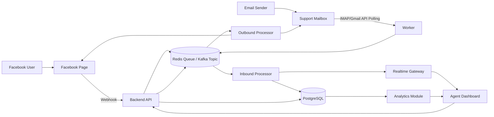
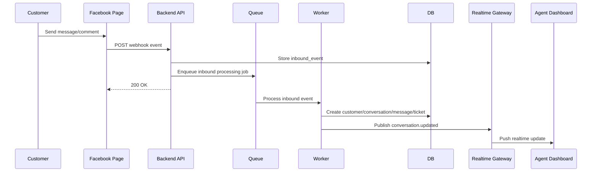
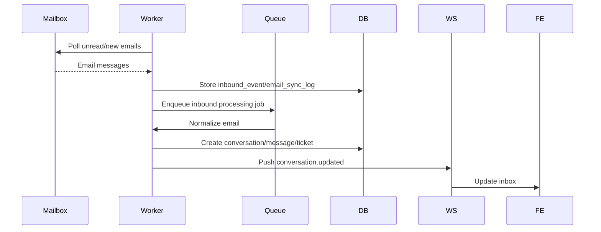
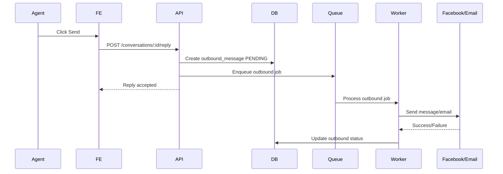
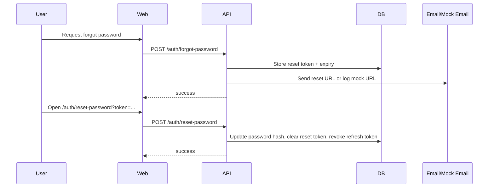
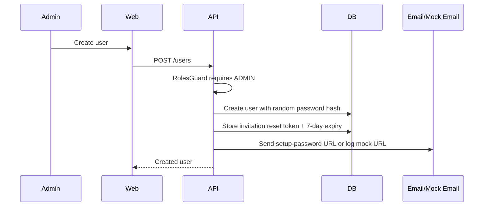

# OmniDesk Architecture

## 1. Architectural Decision

OmniDesk chọn kiến trúc:

> Modular Monolith + Worker + Queue/Event Bus

Lý do:

- Phù hợp phạm vi mini-project.
- Dễ triển khai, debug và demo hơn full microservice.
- Vẫn thể hiện được tư duy service boundary, event-driven processing, queue, retry và idempotency.
- Có khả năng tách dần thành microservice trong tương lai.

## 2. High-level Architecture



## 3. Runtime Components

| Component | Vai trò |
|---|---|
| `apps/web` | Giao diện agent/admin: inbox, conversation, ticket, dashboard |
| `apps/api` | Backend API chính: auth, RBAC, user management, inbox API, webhook endpoint, WebSocket/SSE |
| `apps/worker` | Xử lý nền: email polling, inbound processing, outbound sending, retry, SLA |
| `PostgreSQL` | Lưu dữ liệu chính |
| `Redis` | Queue, cache, pub/sub, rate limiting |
| `Kafka/Redpanda` | Optional future event streaming |
| `Object Storage` | Optional, lưu attachment |

Luồng production/live-ready ưu tiên provider thật: Facebook Webhooks/Graph API cho message/comment và IMAP/SMTP cho email. Mock adapter chỉ giữ vai trò fallback cho local development, demo khi mạng/Ngrok/provider lỗi, hoặc test contract mà không gọi external API.

## 4. Repository Structure

```txt
omnidesk/
  apps/
    web/
    api/
    worker/
  packages/
    shared/
  docs/
  docker-compose.yml
  package.json
  README.md
```

### 4.1. `apps/web`

```txt
apps/web/src/
  app/
  components/
  features/
    inbox/
    conversations/
    tickets/
    dashboard/
    settings/
  lib/
```

### 4.2. `apps/api`

```txt
apps/api/src/
  main.ts
  app.module.ts
  modules/
    auth/
    users/
    customers/
    conversations/
    messages/
    tickets/
    channels/
      facebook/
      email/
    outbound/
    notifications/
    sla/
    analytics/
    ai-assist/
  common/
    database/
    guards/
    filters/
    interceptors/
    queues/
    events/
```

### 4.3. `apps/worker`

```txt
apps/worker/src/
  main.ts
  processors/
    inbound-message.processor.ts
    outbound-message.processor.ts
    email-sync.processor.ts
    email-actions.processor.ts
    sla-check.processor.ts
    sla-check.scheduler.ts
    auto-close.processor.ts
    auto-close.scheduler.ts
  jobs/
  common/
```

### 4.4. `packages/shared`

```txt
packages/shared/src/
  types/
    normalized-message.ts
    conversation.ts
    ticket.ts
  events/
    event-names.ts
    event-payloads.ts
  constants/
  utils/
```

## 5. Module Boundaries

### 5.1. Auth Module

Trách nhiệm:

- Đăng nhập, Đăng xuất, Gia hạn phiên.
- Cấp phát và quản lý Access Token (stateless, 15m) & Refresh Token (stateful, hash trong DB, 7d).
- Bảo mật 100% qua HttpOnly Cookies.
- Role-based access control.
- Quên mật khẩu và đặt lại mật khẩu bằng token có thời hạn.

Không chịu trách nhiệm:

- Không xử lý conversation/ticket.
- Không gọi provider bên ngoài.

### 5.1.1. Users Module

Trách nhiệm:

- Quản lý hồ sơ user nội bộ (`ADMIN`, `AGENT`).
- Cung cấp danh sách agent active để assign conversation/ticket.
- Cho phép admin xem danh sách user, tạo user mới và chuyển trạng thái `ACTIVE`/`INACTIVE`.
- Sinh invitation token cho user mới để tự đặt mật khẩu ban đầu.

Không chịu trách nhiệm:

- Không xác thực password trong luồng login.
- Không xử lý ticket/conversation ngoài quan hệ assignment.

### 5.2. Facebook Module

Trách nhiệm:

- Verify Facebook webhook.
- Nhận raw Facebook event.
- Parse Facebook event.
- Gửi message/comment ra Facebook qua Graph API.
- Cung cấp mock adapter/dev endpoint làm fallback, không phải luồng production chính.
- Lưu Facebook event log nếu cần.

Không chịu trách nhiệm:

- Không tự quyết định ticket status.
- Không tự xử lý SLA.
- Không trực tiếp cập nhật analytics.

### 5.3. Email Module

Trách nhiệm:

- Cấu hình mailbox IMAP/SMTP.
- Poll email live qua IMAP hoặc nhận notification khi mở rộng.
- Parse email.
- Gửi email outbound qua SMTP.
- Cung cấp mock adapter/dev endpoint làm fallback, không phải luồng production chính.
- Lưu email sync log.

Không chịu trách nhiệm:

- Không tự xử lý business workflow của ticket.
- Không trực tiếp push UI.

### 5.4. Conversation Module

Trách nhiệm:

- Quản lý customer/conversation/message.
- Chuẩn hóa message inbound.
- Lưu timeline hội thoại.
- Cung cấp API cho inbox.

Không chịu trách nhiệm:

- Không biết chi tiết Facebook API hoặc SMTP/IMAP.
- Không trực tiếp gửi message ra provider.

### 5.5. Ticket Module

Trách nhiệm:

- Tạo/cập nhật ticket.
- Status, priority, assignment, tag.
- SLA deadline.

Không chịu trách nhiệm:

- Không parse Facebook/email raw payload.
- Không gửi outbound message.

### 5.6. Outbound Module

Trách nhiệm:

- Nhận yêu cầu gửi reply.
- Tạo outbound message với trạng thái pending.
- Đẩy job cho worker gửi ra channel tương ứng.
- Cập nhật trạng thái sent/failed/retrying.

### 5.7. Notification Module

Trách nhiệm:

- WebSocket/SSE gateway.
- Push event realtime cho frontend.
- Không chứa business logic chính.

### 5.8. Analytics Module

Trách nhiệm:

- Tính toán thống kê ticket/conversation.
- Dashboard metrics.
- Có thể consume event trong tương lai.

## 6. Data Integrity & Concurrency Control

Hệ thống được thiết kế đặc biệt để chịu tải cao và xử lý đồng thời an toàn:

### 6.1. Optimistic Concurrency Control (OCC)
Các hành động nhạy cảm như Gán Agent (Assign), Đổi Trạng Thái (Status), Đổi Độ ưu tiên (Priority) được bảo vệ bằng cơ chế OCC. Mỗi bản ghi `Conversation` lưu trữ một trường `version`. Mọi thao tác cập nhật sẽ kiểm tra `version` khớp với lúc đọc. Nếu có xung đột (Race Condition), hệ thống sẽ trả về lỗi **HTTP 409 Conflict** để frontend xử lý (ví dụ: tự động reload lại dữ liệu mới nhất).

### 6.2. Queue Idempotency
Worker Queue (BullMQ) kết hợp với Prisma Unique Constraints (như lỗi `P2002`) để tạo cơ chế **Idempotency**. Việc tiếp nhận Webhook từ Facebook/Email có thể bị lặp lại hoặc xử lý đồng thời, nhưng nhờ chặn ở Database và bắt lỗi chủ động trong quá trình chèn dữ liệu (`events.service.ts`), hệ thống không bao giờ bị Crash hay sinh ra dữ liệu rác (Data Corruption).

## 7. Main Data Flow

### 7.1. Inbound Facebook Message Flow



### 7.2. Inbound Email Flow



### 7.3. Outbound Reply Flow



### 7.4. Password Reset Flow



### 7.5. Admin User Management Flow



## 8. Why Not Full Microservice in MVP?

Full microservice yêu cầu thêm:

- API Gateway.
- Service discovery.
- Distributed logging.
- Tracing.
- Inter-service authentication.
- Event schema/versioning.
- Independent deployment.
- Database per service.

Với mini-project, các phần này có thể làm tăng rủi ro demo. Vì vậy OmniDesk chọn Modular Monolith nhưng có thiết kế sẵn boundary để tách dần.

## 9. Future Microservice Migration Path

### Step 1 - Current MVP

```txt
web
api
worker
postgres
redis
```

### Step 2 - Extract Integration Workers

```txt
web
api
facebook-worker
email-worker
worker
postgres
redis
```

### Step 3 - Extract Channel Services

```txt
web
api-gateway
facebook-service
email-service
conversation-module still in api
ticket-module still in api
notification-service
postgres
redis/kafka
```

### Step 4 - Extract Core Services

```txt
api-gateway
conversation-service
ticket-service
customer-service
facebook-service
email-service
notification-service
analytics-service
kafka
redis
postgres per service or schema per service
```

### Step 5 - Enterprise Deployment

```txt
Kubernetes
Service mesh optional
Centralized logging
Distributed tracing
CI/CD per service
Kafka with schema registry
Database per service
Read models for dashboard
```

## 9. Key Architectural Rules

1. Module không được truy cập tùy tiện dữ liệu thuộc ownership của module khác.
2. Integration module phải convert provider payload thành normalized contract.
3. Core domain không phụ thuộc chi tiết Facebook/Email API.
4. Các tác vụ chậm phải xử lý qua queue/worker.
5. Gửi outbound phải đi qua outbox/outbound message.
6. Webhook phải có idempotency.
7. Event contract phải versioned nếu đưa sang Kafka/microservice.
8. Live provider adapter là luồng chính; mock mode là fallback chính thức cho local demo/test contract.

## 10. Technology Recommendation

| Layer | Recommended |
|---|---|
| Frontend | Next.js hoặc React + Vite |
| UI | Tailwind CSS + shadcn/ui |
| Backend | NestJS |
| API Docs | Swagger OpenAPI (`@nestjs/swagger`) |
| ORM | Prisma |
| Database | PostgreSQL |
| Queue | Redis + BullMQ |
| Event Streaming Future | Redpanda/Kafka |
| Realtime | WebSocket hoặc SSE |
| Email | Nodemailer + IMAP/mailparser, mock adapter fallback |
| Facebook | Webhook adapter + Graph API client, mock adapter fallback |
| Deployment | Docker Compose |

## 11. Security & API Policies

Dự án Omnidesk được thiết kế với các tiêu chuẩn Application Security chặt chẽ từ những ngày đầu (tham chiếu API Security Best Practices):

1. **Authentication (Auth):** Sử dụng hệ thống JWT với **HttpOnly Cookies** để miễn nhiễm với các cuộc tấn công XSS. Token có tuổi thọ ngắn (15 phút) kết hợp Refresh Token Rotation.
2. **Authorization (RBAC):** Cấp quyền truy cập ở mức Controller/Endpoint qua `RolesGuard` (`ADMIN`, `AGENT`).
3. **Password Recovery:** Reset/invitation token được lưu với expiry, không tiết lộ email tồn tại trong forgot-password response, và refresh token bị thu hồi sau khi đổi mật khẩu.
4. **Admin User Management:** Các endpoint `/users`, `/users/:id/status` chỉ mở cho `ADMIN`; agent chỉ được xem danh sách agent active phục vụ assignment.
5. **Input Validation:** Áp dụng `ValidationPipe` toàn cục. Bật chế độ `whitelist: true` và `forbidNonWhitelisted: true` để tự động loại bỏ mọi dữ liệu rác hoặc mã độc từ payload của Client.
6. **Rate Limiting:** Sử dụng `@nestjs/throttler` làm Global Guard. Giới hạn mặc định: **100 requests / 1 phút** trên mỗi IP để ngăn chặn tấn công DDoS/Brute-force.
7. **CORS & Whitelist:** API chỉ phản hồi lại các request đến từ tên miền Frontend hợp lệ (được cấu hình qua biến môi trường `WEB_ORIGIN`).
8. **API Versioning:** Bắt buộc áp dụng URI Versioning (`/api/v1`) cho mọi endpoint để đảm bảo tính tương thích ngược trong tương lai.
9. **Provider Webhook Security:** Facebook live webhook phải xác thực verify token và chữ ký `X-Hub-Signature-256`; provider tokens không được log ra console hoặc commit vào repository.
10. **CI/CD Security Pipeline:** Tích hợp workflow GitHub Actions (`security-scan`) chạy tự động để kiểm tra lỗ hổng thư viện (`pnpm audit`) và quét lộ lọt mã bí mật (`gitleaks`) trước mỗi bản phát hành.
11. **API Documentation:** Tài liệu API được sinh tự động theo chuẩn OpenAPI (Swagger UI) từ mã nguồn thông qua `@nestjs/swagger`, hỗ trợ tương tác và kiểm thử trực tiếp bằng Cookie Auth tại `/api/docs`.
