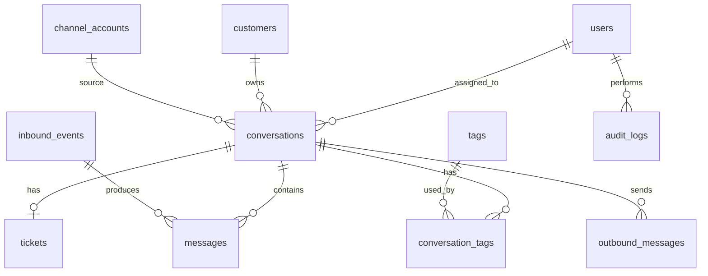

# OmniDesk Database Design

## 1. Design Goals

Database của OmniDesk cần hỗ trợ:

- Chuẩn hóa dữ liệu từ Facebook và Email.
- Lưu lịch sử hội thoại.
- Quản lý ticket, assignment, priority, SLA.
- Debug event từ provider bên ngoài.
- Retry outbound message.
- Sẵn sàng tách module thành microservice.

## 2. Core Domain Model



## 3. Tables

## 3.1. `users`

Lưu tài khoản admin/agent.

| Column | Type | Note |
|---|---|---|
| id | UUID | PK |
| name | VARCHAR |  |
| email | VARCHAR | Unique |
| password_hash | VARCHAR |  |
| hashed_refresh_token | VARCHAR | Lưu trữ Refresh Token được mã hoá (Bcrypt) |
| password_reset_token | VARCHAR | Nullable, token cho forgot password hoặc invitation |
| password_reset_expires | TIMESTAMP | Nullable, thời điểm token hết hạn |
| role | VARCHAR | `ADMIN`, `AGENT` |
| status | VARCHAR | `ACTIVE`, `INACTIVE` |
| created_at | TIMESTAMP |  |
| updated_at | TIMESTAMP |  |

Ghi chú:

- Forgot password token có hiệu lực 1 giờ.
- Invitation token khi admin tạo user mới có hiệu lực 7 ngày.
- Sau khi đặt lại mật khẩu thành công, `password_reset_token` và `password_reset_expires` bị xóa; `hashed_refresh_token` cũng bị xóa để thu hồi phiên đăng nhập cũ.

## 3.2. `customers`

Lưu thông tin khách hàng đã tương tác.

| Column | Type | Note |
|---|---|---|
| id | UUID | PK |
| name | VARCHAR | Nullable |
| email | VARCHAR | Nullable |
| phone | VARCHAR | Nullable |
| avatar_url | TEXT | Nullable |
| external_facebook_id | VARCHAR | Nullable |
| created_at | TIMESTAMP |  |
| updated_at | TIMESTAMP |  |

Index đề xuất:

- `email`
- `external_facebook_id`

## 3.3. `channel_accounts`

Lưu tài khoản/kênh được tích hợp.

| Column | Type | Note |
|---|---|---|
| id | UUID | PK |
| type | VARCHAR | `FACEBOOK`, `EMAIL` |
| display_name | VARCHAR | Ví dụ: Page name hoặc support mailbox |
| external_id | VARCHAR | Page ID, mailbox address |
| access_token_encrypted | TEXT | Nullable |
| refresh_token_encrypted | TEXT | Nullable |
| config_json | JSONB | Provider-specific config |
| status | VARCHAR | `ACTIVE`, `INACTIVE`, `ERROR` |
| created_at | TIMESTAMP |  |
| updated_at | TIMESTAMP |  |

## 3.4. `conversations`

Đại diện cho một thread/hội thoại đã được normalize.

| Column | Type | Note |
|---|---|---|
| id | UUID | PK |
| channel_type | VARCHAR | `FACEBOOK_MESSAGE`, `FACEBOOK_COMMENT`, `EMAIL` |
| channel_account_id | UUID | FK |
| customer_id | UUID | FK |
| external_conversation_id | VARCHAR | Nullable |
| subject | TEXT | Email subject hoặc generated title |
| status | VARCHAR | `NEW`, `IN_PROGRESS`, `WAITING_CUSTOMER`, `RESOLVED`, `CLOSED` |
| priority | VARCHAR | `LOW`, `MEDIUM`, `HIGH`, `URGENT` |
| assigned_agent_id | UUID | FK nullable |
| last_message_at | TIMESTAMP |  |
| first_response_at | TIMESTAMP | Nullable |
| resolved_at | TIMESTAMP | Nullable |
| is_read | BOOLEAN | Default false |
| version | INT | Dùng cho Optimistic Concurrency Control (OCC) |
| created_at | TIMESTAMP |  |
| updated_at | TIMESTAMP |  |

Index đề xuất:

- `(status, last_message_at)`
- `(channel_type, last_message_at)`
- `assigned_agent_id`
- `customer_id`
- `external_conversation_id`

## 3.5. `messages`

Lưu từng message trong conversation.

| Column | Type | Note |
|---|---|---|
| id | UUID | PK |
| conversation_id | UUID | FK |
| inbound_event_id | UUID | FK nullable |
| direction | VARCHAR | `INBOUND`, `OUTBOUND` |
| sender_type | VARCHAR | `CUSTOMER`, `AGENT`, `SYSTEM` |
| sender_id | UUID | Nullable, agent id nếu sender là agent |
| content | TEXT |  |
| content_type | VARCHAR | `TEXT`, `HTML`, `ATTACHMENT`, `SYSTEM` |
| external_message_id | VARCHAR | Nullable |
| raw_payload | JSONB | Nullable |
| delivery_status | VARCHAR | `RECEIVED`, `PENDING`, `SENT`, `FAILED` |
| sent_at | TIMESTAMP | Nullable |
| created_at | TIMESTAMP |  |

Unique/index đề xuất:

- Unique `(conversation_id, external_message_id)` nếu `external_message_id` có giá trị.
- Index `conversation_id, created_at`.

## 3.6. `tickets`

Quản lý ticket gắn với conversation.

| Column | Type | Note |
|---|---|---|
| id | UUID | PK |
| conversation_id | UUID | FK unique |
| status | VARCHAR | `NEW`, `ASSIGNED`, `IN_PROGRESS`, `WAITING_CUSTOMER`, `RESOLVED`, `CLOSED` |
| priority | VARCHAR | `LOW`, `MEDIUM`, `HIGH`, `URGENT` |
| assigned_agent_id | UUID | FK nullable |
| sla_due_at | TIMESTAMP | Nullable |
| sla_paused_at | TIMESTAMP | Nullable |
| is_overdue | BOOLEAN | Default false |
| first_response_due_at | TIMESTAMP | Nullable |
| resolved_at | TIMESTAMP | Nullable |
| closed_at | TIMESTAMP | Nullable |
| created_at | TIMESTAMP |  |
| updated_at | TIMESTAMP |  |

Index đề xuất:

- `(status, priority)`
- `assigned_agent_id`
- `sla_due_at`

## 3.7. `tags`

| Column | Type | Note |
|---|---|---|
| id | UUID | PK |
| name | VARCHAR | Unique |
| color | VARCHAR | Optional |
| created_at | TIMESTAMP |  |

## 3.8. `conversation_tags`

| Column | Type | Note |
|---|---|---|
| conversation_id | UUID | FK |
| tag_id | UUID | FK |
| created_at | TIMESTAMP |  |

Primary key:

- `(conversation_id, tag_id)`

## 3.9. `inbound_events`

Lưu raw event từ Facebook/email trước khi normalize.

| Column | Type | Note |
|---|---|---|
| id | UUID | PK |
| provider | VARCHAR | `FACEBOOK`, `EMAIL` |
| event_type | VARCHAR | `MESSAGE`, `COMMENT`, `EMAIL_RECEIVED` |
| external_event_id | VARCHAR | Nullable |
| dedup_key | VARCHAR | Unique |
| raw_payload | JSONB |  |
| normalized_status | VARCHAR | `PENDING`, `PROCESSED`, `FAILED`, `DUPLICATED` |
| error_message | TEXT | Nullable |
| received_at | TIMESTAMP |  |
| processed_at | TIMESTAMP | Nullable |

Index đề xuất:

- Unique `dedup_key`
- `(provider, event_type, received_at)`
- `normalized_status`

## 3.10. `outbound_messages`

Outbox table cho message do agent gửi.

| Column | Type | Note |
|---|---|---|
| id | UUID | PK |
| conversation_id | UUID | FK |
| channel_type | VARCHAR | `FACEBOOK_MESSAGE`, `FACEBOOK_COMMENT`, `EMAIL` |
| provider | VARCHAR | `FACEBOOK`, `EMAIL` |
| recipient_external_id | VARCHAR | Nullable |
| content | TEXT |  |
| status | VARCHAR | `PENDING`, `SENDING`, `SENT`, `FAILED`, `RETRYING` |
| retry_count | INT | Default 0 |
| max_retries | INT | Default 3 |
| last_error | TEXT | Nullable |
| external_message_id | VARCHAR | Nullable |
| created_by | UUID | FK users |
| created_at | TIMESTAMP |  |
| sent_at | TIMESTAMP | Nullable |
| updated_at | TIMESTAMP |  |

Index đề xuất:

- `(status, created_at)`
- `conversation_id`
- `provider`

## 3.11. `email_sync_logs`

| Column | Type | Note |
|---|---|---|
| id | UUID | PK |
| channel_account_id | UUID | FK |
| sync_started_at | TIMESTAMP |  |
| sync_finished_at | TIMESTAMP | Nullable |
| status | VARCHAR | `SUCCESS`, `FAILED`, `PARTIAL` |
| fetched_count | INT |  |
| processed_count | INT |  |
| error_message | TEXT | Nullable |

## 3.12. `webhook_events`

Optional nếu muốn tách riêng Facebook webhook raw event ngoài `inbound_events`.

| Column | Type | Note |
|---|---|---|
| id | UUID | PK |
| provider | VARCHAR | `FACEBOOK` |
| event_type | VARCHAR |  |
| external_event_id | VARCHAR | Nullable |
| payload | JSONB |  |
| status | VARCHAR | `RECEIVED`, `PROCESSED`, `FAILED` |
| received_at | TIMESTAMP |  |
| processed_at | TIMESTAMP | Nullable |

Nếu đã dùng `inbound_events`, bảng này có thể không cần.

## 3.13. `audit_logs`

Lưu thao tác quan trọng của user/agent.

| Column | Type | Note |
|---|---|---|
| id | UUID | PK |
| actor_id | UUID | FK users nullable |
| action | VARCHAR | Ví dụ: `TICKET_ASSIGNED`, `MESSAGE_REPLIED` |
| target_type | VARCHAR | `CONVERSATION`, `TICKET`, `MESSAGE` |
| target_id | UUID |  |
| metadata | JSONB |  |
| created_at | TIMESTAMP |  |

## 4. Idempotency Strategy

Webhook/email polling có thể tạo duplicate event (vd: Webhook storms từ Facebook). Hệ thống sử dụng `dedup_key`.

Quy trình Idempotency ở Worker (`events.service.ts`):
1. Tính toán `dedup_key` (vd: hash của Facebook message id).
2. Insert vào bảng `inbound_events`.
3. Nếu bảng đã có `dedup_key` này, Prisma sẽ ném lỗi **P2002 Unique Constraint**.
4. Bắt lỗi P2002 và âm thầm bỏ qua (skip), coi như event đã được xử lý (Graceful Degradation), ngăn chặn duplicate records mà không làm crash Worker.

Ví dụ:

```txt
FACEBOOK_MESSAGE:{page_id}:{message_id}
FACEBOOK_COMMENT:{page_id}:{comment_id}
EMAIL:{mailbox}:{message_id}
```

Quy tắc:

1. Mỗi inbound event phải có `dedup_key`.
2. `dedup_key` phải unique.
3. Nếu insert conflict, đánh dấu event là duplicated hoặc bỏ qua.
4. Worker phải xử lý an toàn nếu job bị retry.

## 5. Database Ownership for Microservice Readiness

Dù MVP dùng chung PostgreSQL, cần xác định ownership:

| Module | Bảng sở hữu |
|---|---|
| Auth | `users` |
| Customer/Conversation | `customers`, `conversations`, `messages` |
| Ticket | `tickets`, `tags`, `conversation_tags` |
| Integration | `channel_accounts`, `inbound_events`, `email_sync_logs` |
| Outbound | `outbound_messages` |
| Audit | `audit_logs` |
| Analytics | Có thể dùng read queries hoặc materialized views |

Quy tắc:

- Module khác không được update trực tiếp bảng không thuộc ownership.
- Nếu cần thay đổi, gọi service/module owner.
- Khi tách microservice, ownership này trở thành database boundary.

## 6. Optional PostgreSQL Schema Layout

Có thể chia schema logic:

```txt
auth.users
crm.customers
inbox.conversations
inbox.messages
ticketing.tickets
ticketing.tags
integration.channel_accounts
integration.inbound_events
outbox.outbound_messages
audit.audit_logs
```

Không bắt buộc cho MVP, nhưng giúp báo cáo kiến trúc rõ hơn.

## 7. Migration Notes

Nếu sau này nâng cấp lên microservice:

1. Giữ nguyên `NormalizedMessage` và event contract.
2. Tách Integration Service trước vì ít phụ thuộc core data.
3. Tách Notification/Analytics Service sau vì có thể consume event.
4. Tách Conversation/Ticket cuối cùng vì liên quan core transaction.
5. Khi tách database, cần dùng event để đồng bộ read model.
