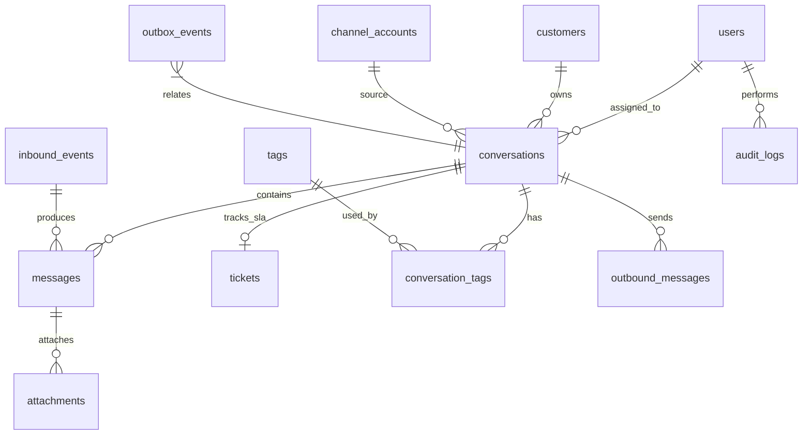

# OmniDesk Database Design

## 1. Design Goals

Database của OmniDesk cần hỗ trợ:

- Chuẩn hóa dữ liệu từ Facebook và Email.
- Lưu lịch sử hội thoại, tin nhắn và file/ảnh đính kèm (Object Storage).
- Quản lý ticket, assignment, priority, SLA theo nguyên tắc Single Source of Truth.
- Lưu trữ Transactional Outbox Events phục vụ at-least-once delivery và replay.
- Debug event từ provider bên ngoài với đầy đủ idempotency.
- Sẵn sàng tách module thành microservice.

## 2. Core Domain Model


```mermaid
erDiagram
    users ||--o{ conversations : assigned_to
    customers ||--o{ conversations : owns
    conversations ||--o{ messages : contains
    conversations ||--o| tickets : tracks_sla
    conversations ||--o{ conversation_tags : has
    tags ||--o{ conversation_tags : used_by
    channel_accounts ||--o{ conversations : source
    conversations ||--o{ outbound_messages : sends
    inbound_events ||--o{ messages : produces
    messages ||--o{ attachments : attaches
    users ||--o{ audit_logs : performs
    outbox_events }|--|| conversations : relates
```

## 3. Tables

### 3.1. `users`

Lưu tài khoản admin/agent.

| Column | Type | Note |
|---|---|---|
| id | UUID | PK |
| name | VARCHAR | |
| email | VARCHAR | Unique |
| password_hash | VARCHAR | |
| hashed_refresh_token | VARCHAR | Lưu trữ Refresh Token được mã hoá (Bcrypt) |
| password_reset_token | VARCHAR | Nullable, token cho forgot password hoặc invitation |
| password_reset_expires | TIMESTAMP | Nullable, thời điểm token hết hạn |
| role | VARCHAR | `ADMIN`, `AGENT` |
| status | VARCHAR | `ACTIVE`, `INACTIVE` |
| created_at | TIMESTAMP | |
| updated_at | TIMESTAMP | |

Ghi chú:
- Forgot password token có hiệu lực 1 giờ.
- Invitation token khi admin tạo user mới có hiệu lực 7 ngày.
- Sau khi đặt lại mật khẩu thành công, `password_reset_token` và `password_reset_expires` bị xóa; `hashed_refresh_token` cũng bị xóa để thu hồi phiên đăng nhập cũ.

### 3.2. `customers`

Lưu thông tin khách hàng đã tương tác.

| Column | Type | Note |
|---|---|---|
| id | UUID | PK |
| name | VARCHAR | Nullable |
| email | VARCHAR | Unique, Nullable |
| phone | VARCHAR | Nullable |
| avatar_url | TEXT | Nullable |
| external_facebook_id | VARCHAR | Unique, Nullable |
| created_at | TIMESTAMP | |
| updated_at | TIMESTAMP | |

Index đề xuất:
- `email`
- `external_facebook_id`

### 3.3. `channel_accounts`

Lưu tài khoản/kênh được tích hợp.

| Column | Type | Note |
|---|---|---|
| id | UUID | PK |
| type | VARCHAR | `FACEBOOK`, `EMAIL` |
| display_name | VARCHAR | Ví dụ: Page name hoặc support mailbox |
| external_id | VARCHAR | Page ID, mailbox address |
| access_token_encrypted | TEXT | Nullable |
| refresh_token_encrypted | TEXT | Nullable |
| config_json | JSONB | Provider-specific config |
| status | VARCHAR | `ACTIVE`, `INACTIVE`, `ERROR` |
| created_at | TIMESTAMP | |
| updated_at | TIMESTAMP | |

Unique constraint:
- `(type, external_id)`

### 3.4. `conversations`

Đại diện cho một thread/hội thoại đã được normalize (**Single Source of Truth** cho trạng thái hội thoại và gán agent).

| Column | Type | Note |
|---|---|---|
| id | UUID | PK |
| channel_type | VARCHAR | `FACEBOOK_MESSAGE`, `FACEBOOK_COMMENT`, `EMAIL` |
| channel_account_id | UUID | FK |
| customer_id | UUID | FK |
| external_conversation_id | VARCHAR | Nullable |
| subject | TEXT | Email subject hoặc generated title |
| status | VARCHAR | `NEW`, `IN_PROGRESS`, `WAITING_CUSTOMER`, `RESOLVED`, `CLOSED` |
| priority | VARCHAR | `LOW`, `MEDIUM`, `HIGH`, `URGENT` |
| assigned_agent_id | UUID | FK nullable |
| last_message_at | TIMESTAMP | |
| first_response_at | TIMESTAMP | Nullable |
| resolved_at | TIMESTAMP | Nullable |
| is_read | BOOLEAN | Default false |
| version | INT | Dùng cho Optimistic Concurrency Control (OCC) |
| created_at | TIMESTAMP | |
| updated_at | TIMESTAMP | |

Index đề xuất:
- Unique `(channel_account_id, external_conversation_id)`
- `(status, last_message_at)`
- `(channel_type, last_message_at)`
- `assigned_agent_id`
- `customer_id`
- `external_conversation_id`

### 3.5. `messages`

Lưu từng message trong conversation.

| Column | Type | Note |
|---|---|---|
| id | UUID | PK |
| conversation_id | UUID | FK |
| inbound_event_id | UUID | FK nullable |
| direction | VARCHAR | `INBOUND`, `OUTBOUND` |
| sender_type | VARCHAR | `CUSTOMER`, `AGENT`, `SYSTEM` |
| sender_id | UUID | Nullable, agent id nếu sender là agent |
| content | TEXT | |
| content_type | VARCHAR | `TEXT`, `HTML`, `ATTACHMENT`, `SYSTEM` |
| external_message_id | VARCHAR | Nullable |
| reply_to_message_id | VARCHAR | Nullable, trỏ tới tin nhắn được trả lời |
| raw_payload | JSONB | Nullable |
| delivery_status | VARCHAR | `RECEIVED`, `PENDING`, `SENT`, `FAILED` |
| sent_at | TIMESTAMP | Nullable |
| created_at | TIMESTAMP | |

Unique/index đề xuất:
- Unique `(conversation_id, external_message_id)` nếu `external_message_id` có giá trị.
- Index `(conversation_id, created_at)`.

### 3.6. `tickets`

Quản lý SLA countdown gắn với conversation (Các trường nghiệp vụ `status`, `priority`, `assigned_agent_id` được quản lý duy nhất tại `conversations`).

| Column | Type | Note |
|---|---|---|
| id | UUID | PK |
| conversation_id | UUID | FK unique |
| sla_due_at | TIMESTAMP | Nullable, thời hạn SLA phản hồi/giải quyết |
| sla_paused_at | TIMESTAMP | Nullable, thời điểm bắt đầu đóng băng SLA khi chờ khách |
| is_overdue | BOOLEAN | Default false |
| first_response_due_at | TIMESTAMP | Nullable |
| created_at | TIMESTAMP | |
| updated_at | TIMESTAMP | |

Index đề xuất:
- `sla_due_at`
- Unique `conversation_id`

### 3.7. `attachments`

Quản lý tệp/ảnh đính kèm trong tin nhắn, lưu trữ trên MinIO / S3 Object Storage.

| Column | Type | Note |
|---|---|---|
| id | UUID | PK |
| message_id | UUID | FK nullable trỏ tới message |
| storage_key | VARCHAR | Key lưu trữ trong Object Storage Bucket |
| url | TEXT | Đường dẫn URL truy cập tệp |
| file_name | VARCHAR | Tên tệp gốc |
| mime_type | VARCHAR | Loại MIME (vd: `image/png`, `application/pdf`) |
| size_bytes | INT | Kích thước tệp (bytes) |
| created_at | TIMESTAMP | |

Index đề xuất:
- `message_id`

### 3.8. `tags`

| Column | Type | Note |
|---|---|---|
| id | UUID | PK |
| name | VARCHAR | Unique |
| color | VARCHAR | Optional |
| created_at | TIMESTAMP | |

### 3.9. `conversation_tags`

| Column | Type | Note |
|---|---|---|
| conversation_id | UUID | FK |
| tag_id | UUID | FK |
| created_at | TIMESTAMP | |

Primary key:
- `(conversation_id, tag_id)`

### 3.10. `inbound_events`

Lưu raw event từ Facebook/email trước khi normalize.

| Column | Type | Note |
|---|---|---|
| id | UUID | PK |
| provider | VARCHAR | `FACEBOOK`, `EMAIL` |
| event_type | VARCHAR | `MESSAGE`, `COMMENT`, `EMAIL_RECEIVED` |
| external_event_id | VARCHAR | Nullable |
| dedup_key | VARCHAR | Unique |
| raw_payload | JSONB | |
| normalized_status | VARCHAR | `PENDING`, `PROCESSING`, `PROCESSED`, `FAILED`, `DUPLICATED` |
| error_message | TEXT | Nullable |
| received_at | TIMESTAMP | |
| processing_started_at | TIMESTAMP | Nullable |
| processed_at | TIMESTAMP | Nullable |

Index đề xuất:
- Unique `dedup_key`
- `(provider, event_type, received_at)`
- `normalized_status`

### 3.11. `outbound_messages`

Outbox table cho message do agent gửi ra external channels.

| Column | Type | Note |
|---|---|---|
| id | UUID | PK |
| conversation_id | UUID | FK |
| channel_type | VARCHAR | `FACEBOOK_MESSAGE`, `FACEBOOK_COMMENT`, `EMAIL` |
| provider | VARCHAR | `FACEBOOK`, `EMAIL` |
| recipient_external_id | VARCHAR | Nullable |
| content | TEXT | |
| status | VARCHAR | `PENDING`, `SENDING`, `SENT`, `FAILED`, `RETRYING` |
| retry_count | INT | Default 0 |
| max_retries | INT | Default 3 |
| last_error | TEXT | Nullable |
| external_message_id | VARCHAR | Nullable |
| reply_to_message_id | VARCHAR | Nullable |
| created_by | UUID | FK users |
| created_at | TIMESTAMP | |
| sent_at | TIMESTAMP | Nullable |
| updated_at | TIMESTAMP | |

Index đề xuất:
- `(status, created_at)`
- `conversation_id`
- `provider`

### 3.12. `outbox_events`

Bảng Transactional Outbox lưu trữ các sự kiện domain để publish an toàn vào Message Queue (BullMQ/Redis).

| Column | Type | Note |
|---|---|---|
| id | UUID | PK |
| type | VARCHAR | Loại sự kiện (vd: `outbound.message.requested`) |
| aggregate_id | UUID | ID của aggregate (vd: `conversationId` hoặc `outboundMessageId`) |
| payload | JSONB | Dữ liệu chi tiết sự kiện |
| status | VARCHAR | `PENDING`, `PUBLISHED`, `DEAD` |
| attempts | INT | Số lần đã thử publish |
| job_id | VARCHAR | Nullable, ID của BullMQ job |
| error_message | TEXT | Nullable |
| created_at | TIMESTAMP | |
| published_at | TIMESTAMP | Nullable |
| failed_at | TIMESTAMP | Nullable |

Index đề xuất:
- `(status, created_at)`

### 3.13. `email_sync_logs`

| Column | Type | Note |
|---|---|---|
| id | UUID | PK |
| channel_account_id | UUID | FK |
| sync_started_at | TIMESTAMP | |
| sync_finished_at | TIMESTAMP | Nullable |
| status | VARCHAR | `SUCCESS`, `FAILED`, `PARTIAL` |
| fetched_count | INT | |
| processed_count | INT | |
| error_message | TEXT | Nullable |

### 3.14. `audit_logs`

Lưu thao tác quan trọng của user/agent.

| Column | Type | Note |
|---|---|---|
| id | UUID | PK |
| actor_id | UUID | FK users nullable |
| action | VARCHAR | Ví dụ: `TICKET_ASSIGNED`, `MESSAGE_REPLIED` |
| target_type | VARCHAR | `CONVERSATION`, `TICKET`, `MESSAGE` |
| target_id | UUID | |
| metadata | JSONB | |
| created_at | TIMESTAMP | |

## 4. Idempotency Strategy

Webhook/email polling có thể tạo duplicate event (vd: Webhook storms từ Facebook). Hệ thống sử dụng `dedup_key`.

Quy trình Idempotency ở Worker (`events.service.ts`):
1. Tính toán `dedup_key` (vd: hash của Facebook message id hoặc Email Message-ID).
2. Insert vào bảng `inbound_events`.
3. Nếu bảng đã có `dedup_key` này, Prisma sẽ ném lỗi **P2002 Unique Constraint**.
4. Bắt lỗi P2002 và âm thầm bỏ qua (skip), coi như event đã được xử lý (Graceful Degradation), ngăn chặn duplicate records mà không làm crash Worker.

Ví dụ:

```txt
FACEBOOK_MESSAGE:{page_id}:{message_id}
FACEBOOK_COMMENT:{page_id}:{comment_id}
EMAIL:{mailbox}:{message_id}
```

## 5. Database Ownership for Microservice Readiness

Dù hệ thống dùng chung PostgreSQL, quyền sở hữu dữ liệu được phân định rõ ràng theo module:

| Module | Bảng sở hữu |
|---|---|
| Auth | `users` |
| Customer/Conversation | `customers`, `conversations`, `messages`, `attachments` |
| Ticket | `tickets`, `tags`, `conversation_tags` |
| Integration | `channel_accounts`, `inbound_events`, `email_sync_logs` |
| Outbound | `outbound_messages`, `outbox_events` |
| Audit | `audit_logs` |
| Analytics | Read queries hoặc materialized views |

## 6. Migration Notes

1. Toàn bộ các migration được quản lý tập trung bằng Prisma Migrate (`apps/api/prisma/migrations`).
2. Tuyệt đối không dùng `prisma migrate dev` hay `prisma migrate reset` trên môi trường Production; sử dụng `prisma migrate deploy`.
3. Bảng `tickets` và `conversations` đã được quy chuẩn: `conversations` là nguồn thông tin chính xác duy nhất về trạng thái và agent phụ trách, loại bỏ hoàn toàn tình trạng trôi lệch dữ liệu (Data Drift).

